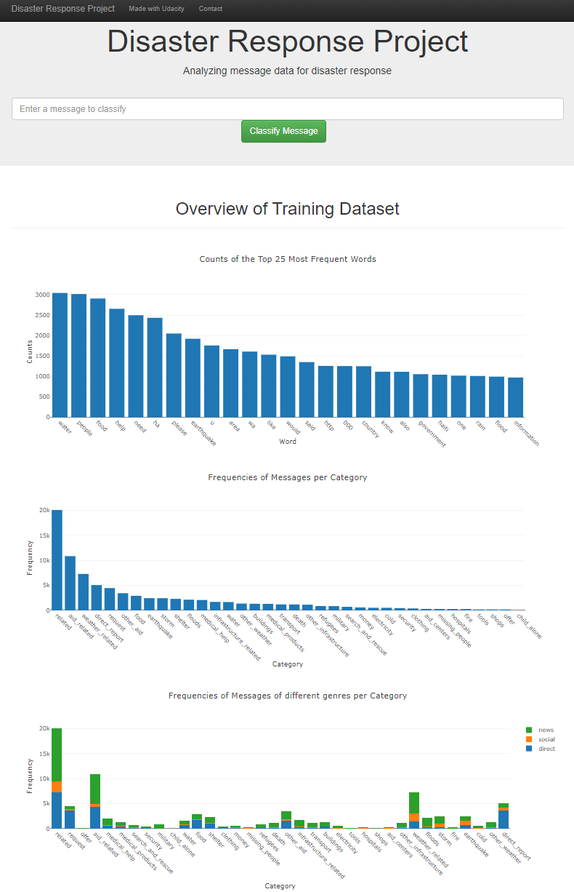
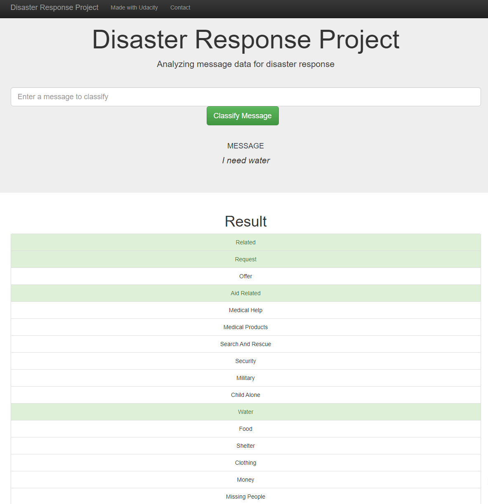

# Disaster Response Pipeline
This repository is for the Project: Disaster Response Pipeline of the [Data Scientist Nanodegree by Udacity](https://www.udacity.com/course/data-scientist-nanodegree--nd025).

## Overview
Keyword searching in not so efficient in classifying disaster response messages, machine learning models can help with this issue. In this project, two datasets of disaster response messages and categories are loaded, combined, cleaned, and saved to a database using the ETL pipeline. Then, a machine learning pipeline with NLP pipeline is deployed to extract the features, fit the model, evaluate the model and save the model. Finally, a web app is used to visualize the cleaned data and classify new disaster response messages based on the fitted model.

## Installation and Executing
Run `pip install requirements.txt` to install the required packages.

 - To run the ETL pipeline that cleans data and stores in database
     `python data/process_data.py data/disaster_messages.csv data/disaster_categories.csv data/DisasterResponse.db`
 - To run the ML pipeline that trains classifier and saves
     `python models/train_classifier.py data/DisasterResponse.db models/classifier.pkl`
 - To run the web app in the app's directory
     `python run.py`
     
## File Descriptions
- `app/`: contains files related to the web application
  - `template/`:
    - `master.html`: index page of the web application
    - `go.html`: the extensive page of the master.html to show the classfication results with input
  - `run.py`: python file to run the Flask application 
  - `visualize_data.py`: python file to return plotly objects
- `data/`: contains files related to the ETL pipeline
  - `disaster_categories.csv`: the dataset for disaster categories
  - `disaster_messages.csv`: the dataset for disaster messages
  - `DisasterResponse.db`: the database with cleaned data for the ML pipline
  - `process.py`: python file to run the ETL pipeline
- `models\`: contains files related to the ML pipeline
  - `train_classifier.py`: python file to run the ML pipeline
  - `classifier.pkl`: saved model
- `images\`: contains snapshots of the web application
  - `snapshot1.png`: snapshot1
  - `snapshot2.png`: snapshot2
    
## Web Application Snapshots
The web application displays visualizations of the cleaned data.

Messages can be classified by clicking `Classify Message` for 36 related categories of the disaster response

## Acknowledgements and License
Author: Zihao Chen 
The data used in this project is provided by [Figure Eight](https://appen.com/). 

## Website
The deployed web application can be found [here](https://medium.com/@chenzh0828/data-tells-you-how-to-choose-airbnb-in-boston-that-fits-you-best-edbb0dd64994).
